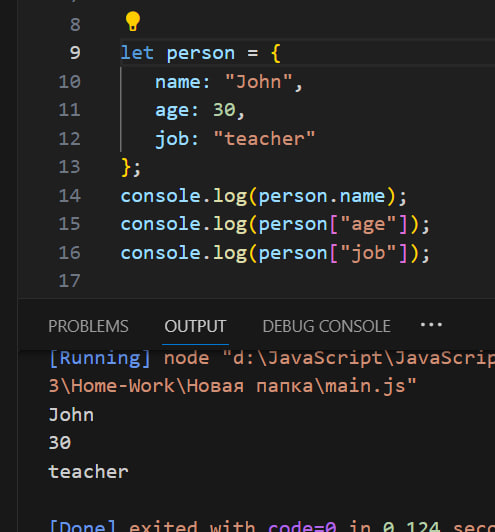
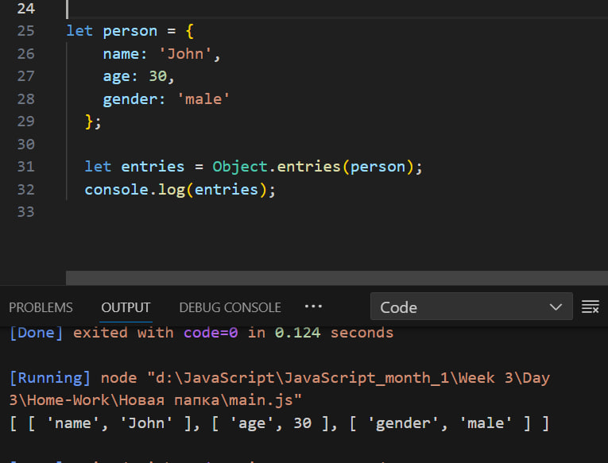
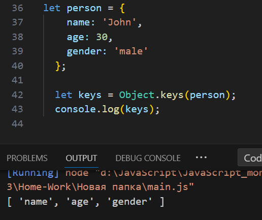
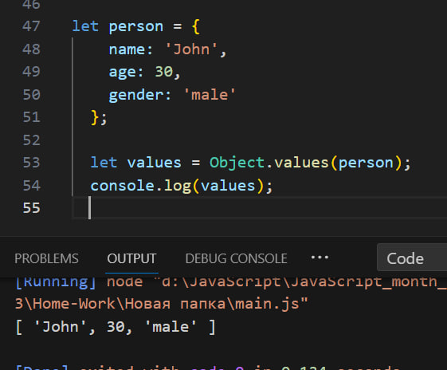

## Object in JavaScript
Object is a collection of key-value pairs, where each key is a string (or symbol) and each value can be any data type, including other objects. This allows us to create complex data structures that can represent real-world entities.

For example:

>
>
>

In JavaScript, the Object class provides three useful methods for working with objects: entries(), keys(), and values(). 

The entries() method returns an array of key-value pairs from the object. Each key-value pair is represented as an array within the main array. This can be useful when you need to iterate over all the key-value pairs in an object.

example of using the entries() method:

>
>
>

The keys() method returns an array of the keys in the object. This can be useful when you need to iterate over all the keys in an object.

example of using the keys() method:

>
>
>

The values() method returns an array of the values in the object. This can be useful when you need to iterate over all the values in an object.

example of using the values() method:

